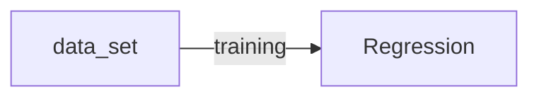

# 머신러닝의 개념과 용어

## Supervised / Unsupervised Learning
- Supervised Learning : labeled data를 가지고 학습
- UnSupervised Learning : un-labeled data를 가지고 학습

## Types of supervised learning
- regression : final exam score based on time spent (0 ~ 100)
- binary classification : pass / non-pass
- multi-label classification : Letter grade (A, B, C, D and F)

## Regression
- data set
|  <center>X</center> |  <center>Y</center> | 
|:--------|:--------:|
| <center>10<center> | <center>90</center> |
| <center>9<center> | <center>80</center> |
| <center>3<center> | <center>50</center> |
| <center>2<center> | <center>30</center> |



## Binary classification
- data set
|  <center>X</center> |  <center>Y</center> | 
|:--------|:--------:|
| <center>10<center> | <center>P</center> |
| <center>9<center> | <center>P</center> |
| <center>3<center> | <center>F</center> |
| <center>2<center> | <center>F</center> |
```mermaid
graph LR;
data_set-->|training|Binary classification ;
```

## Multi-label Classification
|  <center>X</center> |  <center>Y</center> | 
|:--------|:--------:|
| <center>10<center> | <center>A</center> |
| <center>9<center> | <center>B</center> |
| <center>3<center> | <center>D</center> |
| <center>2<center> | <center>F</center> |
```mermaid
graph LR;
data_set-->|training|Multi-label classification ;
```